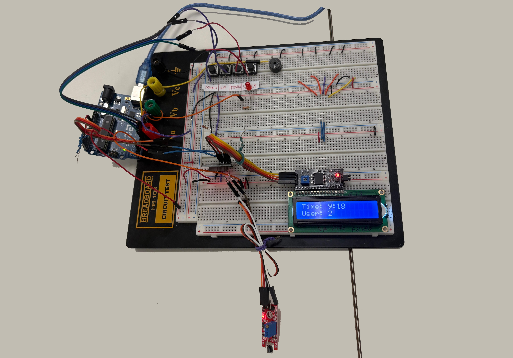
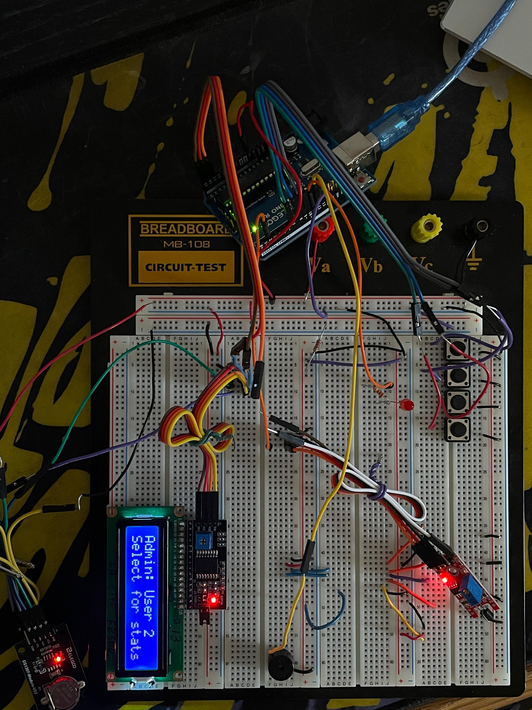
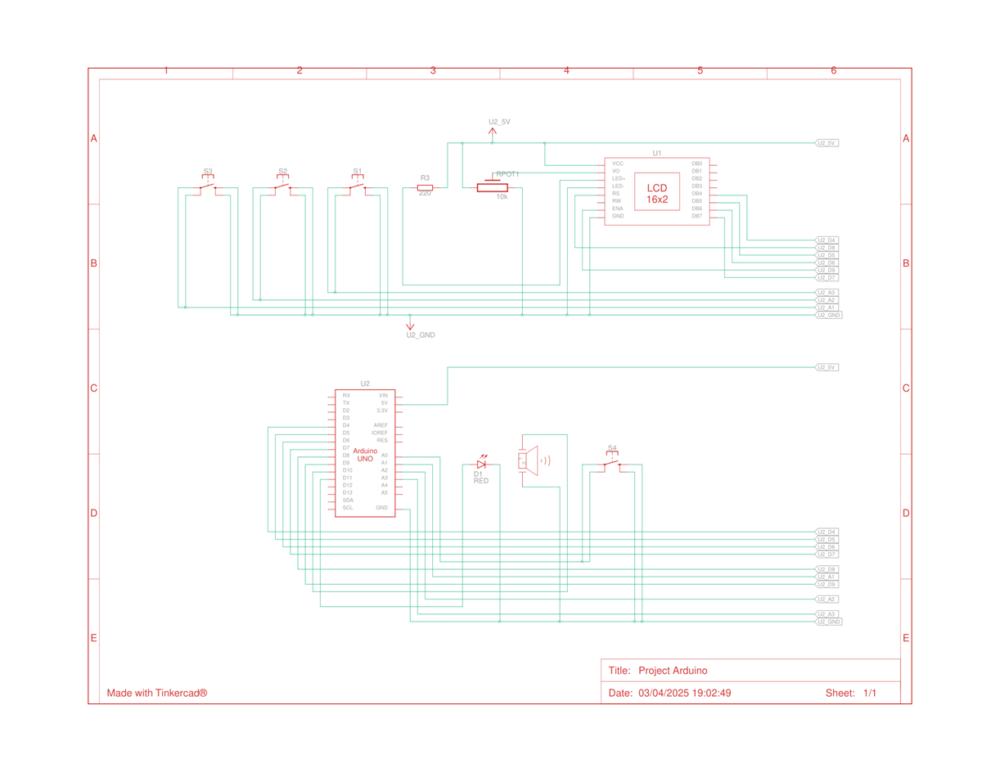
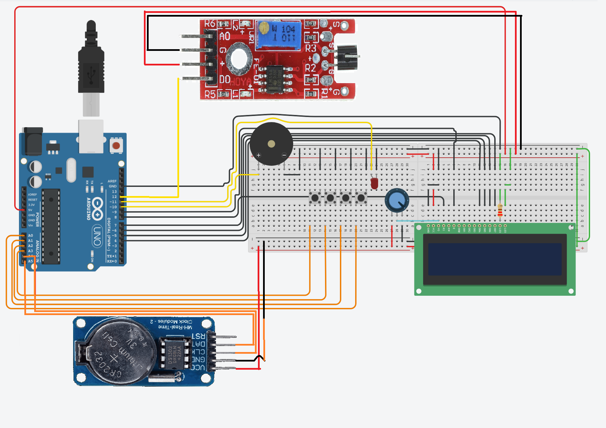

# Arduino Biometric Access Control System

> Touch-sensor authentication · DS1307 RTC time logging · 16×2 I2C LCD · Admin menu · EEPROM storage (up to 105 entries)  
> **La Cité collégiale — Embedded Systems · Winter 2025**

---

## Photos

| Logging Mode | Admin Mode |
|---|---|
|  |  |

---

## Demo Video

> 🎬 **Coming soon** — demonstration video showing touch-sensor authentication, user switching, admin menu navigation, access log review, and EEPROM reset via long-press.

---

## Overview

I designed and built an **Arduino-based access control system** that authenticates users through a **KY-036 metal touch sensor**, logs each access event (user ID + full timestamp) to **on-board EEPROM** using a **DS1307 real-time clock**, and displays live status on a **16×2 I2C LCD**.

I wrote the full Arduino sketch from scratch — all button handling uses software debouncing, the admin menu is driven by a 4-button UI, and the log is stored in a structured 7-byte EEPROM format with circular overwrite protection.

**Key specs:**
- Up to **105 access log entries** (7 bytes/entry × 105 = 735 bytes)
- **2-user support** with per-user log retrieval
- Timestamp resolution: **HH:MM** (hour and minute)
- Audio + visual feedback on every access event

---

## Hardware

| Component | Part / Model | Qty |
|---|---|---|
| Microcontroller | Arduino Uno R3 | 1 |
| Display | 16×2 LCD + I2C backpack (0x27) | 1 |
| RTC Module | Elegoo DS1307 (ds1307-module-v03) | 1 |
| Touch Sensor | KY-036 Metal Touch Sensor | 1 |
| Push-buttons | Tactile switches | 4 |
| Buzzer | Active buzzer 5 V | 1 |
| LED | Red LED + 220 Ω resistor | 1 |
| Power | USB via Arduino Uno | — |

---

## Wiring

```
Arduino Uno R3
├── A4 (SDA) ──── I2C bus ──── LCD I2C backpack + DS1307 RTC
├── A5 (SCL) ──── I2C bus ──── LCD I2C backpack + DS1307 RTC
├── D2  ────────── KY-036 touch sensor (digital output)
├── D7  ────────── SELECT button (INPUT_PULLUP, active-low)
├── D8  ────────── DOWN button   (INPUT_PULLUP, active-low)
├── D9  ────────── UP button     (INPUT_PULLUP, active-low)
├── D10 ────────── MENU button   (INPUT_PULLUP, active-low)
├── D11 ────────── Red LED (+ 220 Ω to GND)
├── D12 ────────── Active buzzer
├── 5V  ────────── VCC rails
└── GND ────────── GND rails
```

> I2C was chosen for the LCD and RTC to minimise pin usage — both devices share the same SDA/SCL bus (A4/A5).  
> All buttons use Arduino internal pull-up resistors (`INPUT_PULLUP`); no external pull-up resistors required.

---

## Schematic

Designed in **Tinkercad Circuits**.

| Formal Schematic | Tinkercad Breadboard View |
|---|---|
|  |  |

The schematic shows the Arduino Uno, 16×2 LCD with I2C backpack (contrast potentiometer + 220 Ω LED resistor), DS1307 RTC on the shared I2C bus, KY-036 touch sensor on D2, red LED on D11, active buzzer on D12, and 4 tactile push-buttons (D7–D10) wired active-low.

---

## System Modes

### Logging Mode (default on power-up)
- LCD displays current time (`HH:MM`) on line 1 and active user (`User: X`) on line 2
- **Touch event:** reads RTC timestamp → stores `{UserID, Year, Month, Day, Hour, Minute}` to EEPROM → flashes LED + beeps buzzer → displays "Access Granted" for 2 seconds
- **UP / DOWN buttons:** toggle between User 1 and User 2

### Admin Mode (MENU button)
- LCD displays selected user and a prompt: `Admin: User X` / `Select for stats`
- **UP button:** select User 1
- **DOWN button:** select User 2
- **SELECT (short press):** display total access count + most recent timestamp for the selected user
- **SELECT (long press, 3 s):** full EEPROM reset — clears all logs and resets the log counter

---

## Button Reference

| Button | Pin | Logging Mode | Admin Mode |
|---|---|---|---|
| MENU | D10 | Enter Admin mode | Exit to Logging mode |
| UP | D9 | Switch to User 1 | Select User 1 |
| DOWN | D8 | Switch to User 2 | Select User 2 |
| SELECT | D7 | — | Short: view log · Long (3 s): reset all |

---

## EEPROM Data Structure

Each access event is stored as **7 consecutive bytes**:

| Offset | Byte(s) | Contents |
|---|---|---|
| +0 | 1 byte | User ID (1 or 2) |
| +1–+2 | 2 bytes | Year (high byte, low byte) |
| +3 | 1 byte | Month |
| +4 | 1 byte | Day |
| +5 | 1 byte | Hour |
| +6 | 1 byte | Minute |

- Max entries: **105** (7 × 105 = 735 bytes; well within the Uno's 1 KB EEPROM)
- Log counter stored at **EEPROM address 250**
- Circular overwrite: index resets to 0 when full

---

## Code

The full Arduino sketch is in this repository: [`Pseudo code et Code_ZAGHLOUL Adam.ini`](Pseudo%20code%20et%20Code_ZAGHLOUL%20Adam%20(1).ini)

Also available on Pastebin: [https://pastebin.com/aRLB4ggq](https://pastebin.com/aRLB4ggq)

**Libraries used:**

| Library | Purpose |
|---|---|
| `Wire.h` | I2C bus communication |
| `LiquidCrystal_I2C.h` | LCD control via I2C backpack |
| `RTClib.h` | DS1307 RTC read/write |
| `EEPROM.h` | Built-in Arduino EEPROM access |

**Code architecture highlights:**
- All button inputs handled with a **50 ms software debounce** (`lastButtonTime` guard)
- Long-press detection implemented with a blocking `while` loop and `millis()` comparison
- `logAccess()` and `showUserStats()` are modular functions — separated from the main loop
- RTC validity check on startup: auto-corrects to compile time if year < 2020
- Battery backup test runs once per power cycle via `testBatteryBackup()`

---

## Pseudocode (System Logic Summary)

```
BEGIN
  INITIALIZE: LCD, RTC, Touch Sensor, Buzzer, LED, Buttons (Menu, Up, Down, Select)
  LOAD log index from EEPROM address 250

  WHILE TRUE:
    current_time ← GET_RTC_TIME()
    touch_state  ← READ_TOUCH_SENSOR()

    IF MODE = LOGGING:
      DISPLAY "Time: HH:MM" / "User: X"
      IF touch_state = ACTIVE:
        LOG {UserID, timestamp} → EEPROM
        FLASH LED + BEEP buzzer
        SHOW "Access Granted" for 2 s

    IF MODE = ADMIN:
      DISPLAY "Admin: User X" / "Select for stats"

    CHECK_BUTTONS()  // Debounced; handles mode toggle, user switch, log view, reset
    DELAY 100 ms
END
```

---

## Problems Encountered & Solutions

| Problem | Root Cause | Solution Applied |
|---|---|---|
| Upload failures | Arduino Nano bootloader/USB issues | Switched to Arduino Uno R3 |
| Compilation errors | Library version conflicts | Updated libraries; resolved header conflicts |
| RTC not responding | Defective DS1307 module | Replaced with a new module |
| Small touch area | KY-036 sensitivity limitation | Documented; proposed fingerprint sensor upgrade |
| EEPROM saturated at 105 entries | Arduino built-in EEPROM limited to 1 KB | Circular overwrite implemented; external EEPROM proposed |

---

## Future Improvements

- Replace KY-036 with a **fingerprint sensor module** for true biometric authentication
- Add **external I2C EEPROM** (e.g. AT24C256, 32 KB) to expand log capacity significantly
- Upgrade display to a **larger LCD or OLED** for multi-line log browsing
- Transfer from breadboard to a **custom PCB** (DesignSpark or KiCad)
- Add **date display** to the log (currently stores full date but only shows HH:MM on LCD)

---

## Skills Demonstrated

`Arduino Uno` `Embedded C/C++` `I2C protocol` `DS1307 RTC` `EEPROM data structures` `16×2 LCD interface` `KY-036 touch sensor` `Software debouncing` `Long-press detection` `Menu-driven UI` `Tinkercad schematic` `Modular code architecture` `Hardware troubleshooting` `System integration`

---

*Adam Zaghloul · La Cité collégiale · Winter 2025 · [adamzaghloul07@gmail.com](mailto:adamzaghloul07@gmail.com)*
